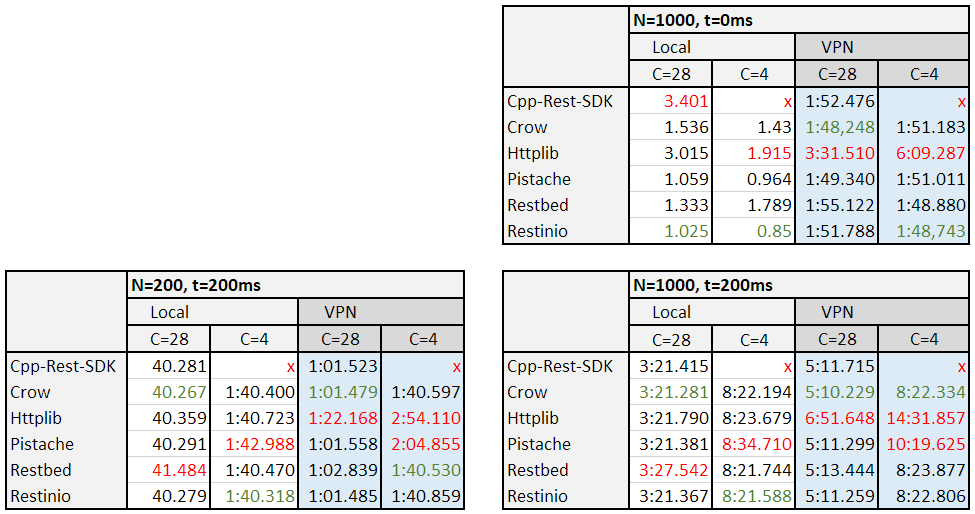

# REST-CPP-benchmark

## Introduction
There are many C++ RESTful frameworks available. This document aims to provide a multidimensional comparison of the most popular ones. The chosen frameworks are:

* C++ REST SDK (https://github.com/microsoft/cpprestsdk) v2.10.15
* Crow (https://github.com/ipkn/crow) v0.1
* HttpLib (https://github.com/yhirose/cpp-httplib) v0.5.8
* Pistache (http://pistache.io/) - v0.0.002
* Restbed (https://github.com/Corvusoft/restbed) v4.6
* Restinio (https://stiffstream.com/en/products/restinio.html) v0.6.2

## Evaluation method
Each framework has been used to create a basic REST services. All services are equivalent and contain 3 endpoints:

* ```/test``` - handles POST message (JSON) and sends it back with additional text and status code 200.
* ```/test/status``` - handles GET message and prints "OK".
* ```/test/labels/<string>``` - handles GET message with parameter. 

The ```/test``` endpoint was used for testing performance. There were 5 testing parameters used to test various aspects:

* A number of producer threads P. They represented unique clients attempting to send message to the service. For all tescases P=10.
* A number of consumer threads C. This was the number of threads used by the service. Two values were tested:
    * C=28 (corresponding to the value of ```hardware_concurrency()``` on the machine used to run tests.
    * C=4 - arbitrarily chosen value smaller than P, to test service queueing.
* A number of messages N sent by a producer. Values: 200 and 1000.
* Processing time t necessary to handle the request. Values: 0ms and 200ms.
* Environment. Two values were used:
    * "Local" - clients and the service were located on the same machine
    * "VPN" - clients and the service were located on different machines connected by a VPN. 

A testcase is any combination of above parameters. There could be in total 16 testcases, but testcases for N=200 and t=0ms. were intentionally excluded as not providing any new information.

Services were deployed on Ubuntu 16.04. To simulate clients, a python script ```postInLoop.py``` was used.

## Test results

All services logged the reception of message and response with millisecond precision. The tables contain time (min:sec.ms) from the reception of the first request to the last reply. The best times are marked in green, the worst in red. Let's number the tests:
* from 1 to 4 in the top-right table,
* from 5 to 8 in the bottom-left table
* from 9 to 12 in the bottom-right table.



Red ```x``` means that the service run into deadlock and test could not be finished.

## Analysis
1. **Cpp-REST-SDK** apparently has problems to handle situation when C < P.
2. In the *sprint* testcases (Local environment, 0ms delay - top right table) the best performance was achieved by **Restinio** which was over 3 times faster than the worst **Cpp-REST-SDK** followed by **Httplib**. It is worth to notice that for some frameworks the best results were achieved using the limited threadpool. It can be explained that if requests require very little processing time, handling of threads themselves becomes noticable.
3. In the Local environment, when request require some processing (bottom tables, white areas), performance of all frameworks is similar. There is no clear winner, but two frameworks slightly fall behind: **Restbed**, when services run at full power (C=28), and **Pistache**, when the threads are limited.
4. Situation changes in the VPN environment, which introduces some time overhead. For most frameworks this overhead is linear and about 105 sec. per 1000 requests, as can be seen comparing tests 1 with 3, 5 with 7 and 9 with 11, with exception of **Httplib**, whose VPN overhead is twice as high (210 sec. per 1000 requests). 
5. For *no delay* cases, limiting of threads has no negative effect on performance of most frameworks or can even slightly improve it, as marked in point 2, but **Httplib** stands out even more.
